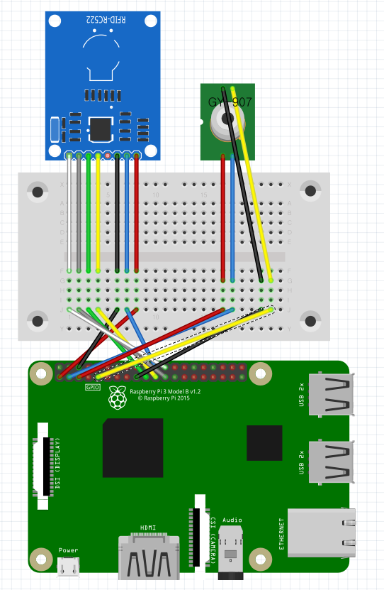

# 온도 측정
라즈베리파이, RFID 리더기, 적외선 온도센서를 사용하여 학생들의 온도를 측정하고 자동으로 DB서버에 정보를 전송하는 시스템을 제작한다.

## 회로도
회로도는 다음과 같다.<br/>


### 라이브러리 설치
RFID센서인 rc-522칩과 gy-906을 사용하기위해 필요 의존성 라이브러리를 설치한다.
```bash
$ sudo pip3 install smbus2
$ sudo pip3 install spidev
$ sudo pip3 install mfrc522
```
